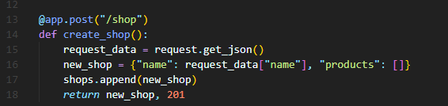
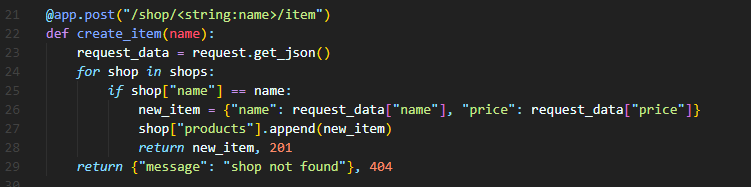
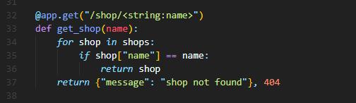
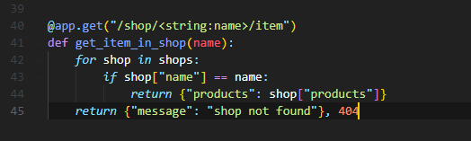

# FlaskAppRest
Este repositorio está enfocado para el desarrollo de una api que reciba peticiones tipo JSON desde el servidor y lo guarde a una estructura de datos este desarrollo esca construido con el lenguaje Python con el uso del framework flask las pruebas se realizaran usando la herramienta postman para generar y realizar las peticiones GET y POST de la tienda.

# Metodo Get Shop
Muestra las todas las tiendas almacenadas

# Metodo Post Shop
creacion  de una nueva tienda

# Metodo Post Item
Este metodo nos permite agregar nuevos items a productos de una tienda especifica 

# Metodo Get shop/<nombre_tienda>
Este metodo nos permite traer los datos almacenados de una tienda especifica

# Metodo get shop/<nombre_tienda>/item
este metodo nos permite  traer unicamente los productos de la tienda especificada

